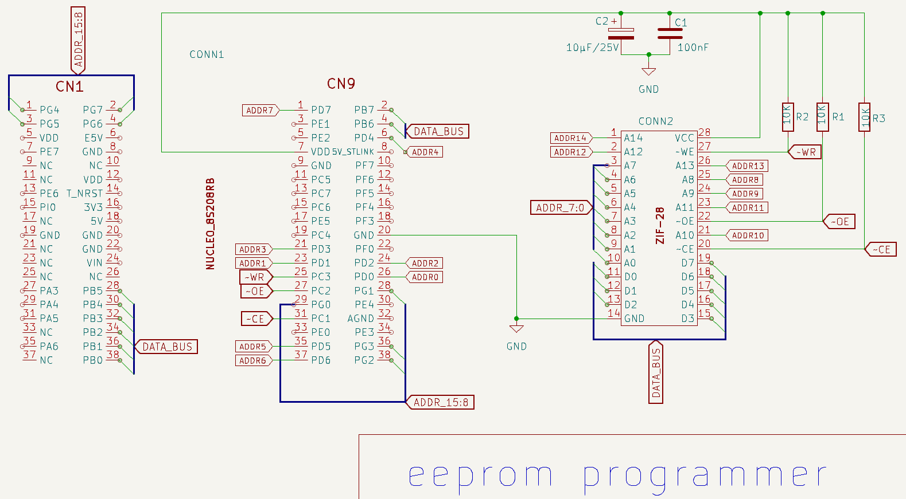

# EEPROM-PROGRAMMER

J'avais besoin d'un programmeur d'EEPROM AT28C64B ou AT28C256  pour un projet. J'ai donc décidé d'en fabriquer un.

## liste matérielle.

1.  Carte [NUCLEO_8S208RB](https://www.st.com/en/evaluation-tools/nucleo-8s208rb.html). 
1.  3 résistance de 10Kohm 1/8 watt.
1.  1 condensateur céramique 100nF. 
1.  1 condensateur électrolytique 10µF/25V 
1.  1 embase DIP-28 sans force d'insertion **(ZIF socket)**.
1.  carte de prototypage à pastille de soudure 7x10cm 
1.  fil AWG 30 pour le filage.

## montage 
La carte de l'embase est conçue pour se brancher sur les connecteurs **CN1** et **CN9** de la carte  NUCLEO_8S208RB.


##  Schématique 
La schématique a étée dessinée dans [KiCAD](KiCAD) version 8.0.6



## utilisation.
L'embase accepte les EEPROM compatibles **AT28C64B** de **8KO** et **AT28C256** de **32KO**  au format **DIP-28**.

Une fois la carte NUCLEO_8S208RB branchée au PC il faut utiliser un émulateur de terminal pour communiquer avec le programmeur.

## Liste des commandes
L'interface reprend le format du [WOZMON](https://github.com/Picatout/pomme-I).  avec quelques différences aux niveaux des commandes. Au lieu de lire et d'écrire dans la mémoire du STM8 les opérations sont effectuées sur l'EEPROM. dans de qui suit **adr** et **data** doivent-être entrés en hexadécimal comme dans le [WOZMON](https://github.com/Picatout/pomme-I).

* **adr&lt;RETURN&gt;** affiche le contenue de l'EEPROM à cette adresse. un point **(.)**suivit de**&lt;RETURN&gt;** affiche le contenu de l'adresse suivante.
* **adr1.adr2&lt;RETURN&gt;** affiche le contenue de la plage mémoire à partir de **adr1** jusqu'à **adr2**. 16 octets sont affichés par ligne.
* **adr: data data data ...&lt;RETURN&gt;** écriture d'une liste d'octets dans la mémoire EEPROM à partir de l'adresse **adr**.
* **adr1Xadr2&lt;RETURN&gt;** Efface la plage mémoire de **adr1** jusqu'à **adr2**.
* **adr"chaîne de caractères ASCII&lt;RETURN&gt;**  programme la chaîne de caractères dans l'EEPROM à partir de l'adresse **adr** la chaîne est terminée par un **0**.

* Il est possible d'entrée une liste de commandes programmation dans un fichier texte et d'utililser la fonction *send RAW file* du terminal pour l'envoyer au programmeur. Cependant le terminal doit-être configuré pour un délais de 10msec entre l'envoie de chaque ligne. C'est le temps que ça prend à l'EEPROM pour compléter la programmation d'une ligne.

## capture d'écran d'une session.
```
eeProg, Copyright Jacques Deschenes, 2025
version 1.0.0

#0
0000: 54   T

#.
0001: 48   H

#.
0002: 45   E

#0.2F
0000: 54 48 45 20 51 55 49 43 4B 20 42 52 4F 57 4E 20   THE QUICK BROWN 
0010: 46 4F 58 20 4A 55 4D 50 20 4F 56 45 52 20 54 48   FOX JUMP OVER TH
0020: 45 20 4C 41 5A 59 20 44 4F 47 2E 00 01 02 03 04   E LAZY DOG.

#0X2F

#0.2F
0000: FF FF FF FF FF FF FF FF FF FF FF FF FF FF FF FF                   
0010: FF FF FF FF FF FF FF FF FF FF FF FF FF FF FF FF                   
0020: FF FF FF FF FF FF FF FF FF FF FF FF FF FF FF FF                   

#0"THE QUICK BROWN FOX JUMP OVER THE LAZY DOG.

#2C: 1 2 3 4 5 6

#32: A B C D E AA 55

#0.3F
0000: 54 48 45 20 51 55 49 43 4B 20 42 52 4F 57 4E 20   THE QUICK BROWN 
0010: 46 4F 58 20 4A 55 4D 50 20 4F 56 45 52 20 54 48   FOX JUMP OVER TH
0020: 45 20 4C 41 5A 59 20 44 4F 47 2E 00 01 02 03 04   E LAZY DOG.
0030: 05 06 0A 0B 0C 0D 0E AA 55 FF FF FF FF FF FF FF   

#   
```
# vidéo de démonstration.
